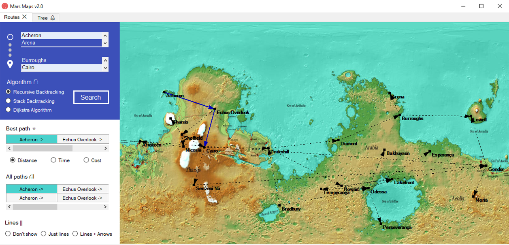

# Mars-Map-Router-Advanced
> A project for COTUCA's data structures II subject. It was developed in C# and presents a map route finder in Mars. The project uses files with the informations of Mars cities to find the best path between them.

This project uses file data to put together a web of paths between cities. This information is used to find all paths and the best path between cities. Made using C# and Windows Forms. The main point of the project is the widespread use of different data structures, such as: graph, tree, binary tree, array, stack and multidimensional array.

This is an version of an existing project (https://github.com/edumigueis/Mars-Map-Router) with some improvements, such as adding AVL tree data structure and Dijkstra Algorithm. In addition to usability adjustments.

## Installation

Download the project and run the .exe file. Or, open the project in your prefered .NET Framework IDE and run it there. 

## Usage example

This project uses really interesting algorithms like backtracking and recursion in binary trees. This implementations can be used in a lot of situations, especially when dealing with locations and paths overall.

## Meta

Copyright (c) Eduardo Migueis and Rodrigo Smith 2020.

Distributed under the GNU GENERAL PUBLIC LICENSE V3 license. See ``LICENSE`` for more information.

[https://github.com/edumigueis/Mars-Map-Router](https://github.com/edumigueis)